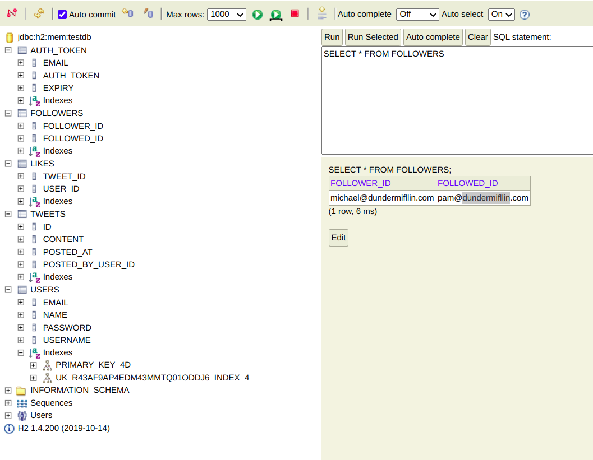

## Twitter Clone

This is a demo application with Twitter like functionality. This application is built using spring boot, this service offers REST APIs. Data exchange happens in JSON format.

### This application provides following features:
* User can register and login using email address
* User can create a post/tweet
* User can search for other user (by username /handle or name)
* User can follow other users
* User can like posts
* User can see feed of other users
* User can like all the posts/tweets of other user
* User can log out

### How to run the project

#### Using Intellij

1. Download and install `Intellij`.  
2. Clone this project
3. Open/Import the maven project via Intellij
4. Run to start the serve
5. Database access: Go to http://localhost:8080/h2-console/ to access database.
6. To test the api's, start with the `/login` api. Login curl request mentioned below includes sample username/password for an already created user. This will return an `authToken`.
7. Use this `authToken` to test any other requests (use curl request mentioned below).
8. POSTMAN API Collection: https://github.com/snoisingla/Twitter/blob/master/Twitter%20Clone.postman_collection.json


### REST APIs
#### User:
##### POST sign-up

Request: 
```$xslt
curl --location --request POST 'http://localhost:8080/sign-up' \
--header 'Content-Type: application/json' \
--data-raw '{"email" : "angela@abc.com",
"name" : "Angella",
"username" : "angella",
"password" : "angella"}'
```

Response: 201
```$xslt
{
    "email": "angela@abc.com",
    "name": "Angella",
    "username": "angella"
}
```

##### POST login

Request:
```$xslt
curl --location --request POST 'http://localhost:8080/login' \
--header 'Content-Type: application/json' \
--data-raw '{"email" : "michael@dundermifflin.com",
"password" : "michael"}'
```

Response: 200
```$xslt
{
    "email": "michael@dundermifflin.com",
    "authToken": "3AFeIxXyothKTG9pDQqRstpx14U4ZDEL"
}
```

##### POST logout

Request:
```$xslt
curl --location --request POST 'http://localhost:8080/logout' \
--header 'authToken: syNmohCJ0GNMQuXsGzhe7tswHnQ0e5R_'
```

Response: 200 
```$xslt
Logged Out
```
##### POST follow-user

Request:
```$xslt
curl --location --request POST 'http://localhost:8080/follow-user' \
--header 'authToken: 3AFeIxXyothKTG9pDQqRstpx14U4ZDEL' \
--header 'Content-Type: application/json' \
--data-raw 'pam@dundermifflin.com'
```

Response: 200 empty

##### GET search-user/{query}

Request:
```$xslt
curl --location --request GET 'http://localhost:8080/search-user/dunder' \
--header 'authToken: KM0zdsNtHgBKuYRMj_TBRimYDcomkriR' \
--data-raw ''
```

Response: 200
```$xslt
[
    {
        "email": "alex@gamil.com.com",
        "name": "Alex",
        "username": "dunder123"
    },
    {
        "email": "rob@yahoo.com",
        "name": "Robdunderguzo",
        "username": "rob123"
    }
]
```

#### Tweet:
##### POST create-post

Request:
```$xslt
curl --location --request POST 'http://localhost:8080/create-post' \
--header 'authToken: Or3xqC-fUPPZR8EmEA7UP_2Cayk0flfb' \
--header 'Content-Type: application/json' \
--data-raw 'pam tweet3'
```

Response: 201
```$xslt
{
    "id": 6,
    "content": "pam tweet3",
    "postedByUser": {
        "email": "pam@dundermifflin.com",
        "name": "Pam",
        "username": "pam-jim"
    },
    "postedAt": "2020-10-04T13:13:15.584+00:00"
}
```

##### POST like-post

Request:
```$xslt
curl --location --request POST 'http://localhost:8080/like-post' \
--header 'authToken: cmOKmQPuSF89fEAHd-GRs9vxolx9ohM1' \
--header 'Content-Type: application/json' \
--data-raw '1'
```

Response: 200 empty
##### POST like-all-posts

Request:
```$xslt
curl --location --request POST 'http://localhost:8080/like-all-posts' \
--header 'authToken: syNmohCJ0GNMQuXsGzhe7tswHnQ0e5R_' \
--header 'Content-Type: text/plain' \
--data-raw 'pam@dundermifflin.com'
```

Response:200 empty

##### GET feed

Request:
```$xslt
curl --location --request GET 'http://localhost:8080/feed' \
--header 'authToken: 3AFeIxXyothKTG9pDQqRstpx14U4ZDEL'
```

Response: 200
```$xslt
[
    {
        "id": 6,
        "content": "pam tweet3",
        "postedByUser": {
            "email": "pam@dundermifflin.com",
            "name": "Pam",
            "username": "pam-jim"
        },
        "postedAt": "2020-10-04T13:13:15.584+00:00"
    },
    {
        "id": 5,
        "content": "pam tweet2",
        "postedByUser": {
            "email": "pam@dundermifflin.com",
            "name": "Pam",
            "username": "pam-jim"
        },
        "postedAt": "2020-10-04T13:13:11.741+00:00"
    }
]
```

### Database
H2 (SQL database) is being used as an in-memory database. This can be easily configured to persist by specifying a backing file path.

**Database Schema**



### How is search implemented?

`GET search-user/{query}` searches for all the users on the handle name as well as the full name.

This is implemented using hibernate search. `username` and `name` columns for the `users` table are indexed. 

Search is powered by Apache Lucene which is a high performance search engine library in Java. Hibernate search provides the integration with Apache Lucene. 

Here, we are executing wild card query in hibernate search to fetch all the users where either username or full name contains the `query` text.

### How is feed implemented?

User's feed is computed in these steps:
1. Find all users which is followed by the given user.
2. Find all tweets of such users.
3. Sort these tweets by their creation time with latest tweet on the top.

There are two more optimizations that can be done here:
1. Support pagination
2. This feed calculation is very compute intensive and won't scale when there are millions of active users in the system. One way to scale is to keep feed in-memory for a user and whenever a new tweet is posted, this tweet gets added to the feed of all such users who are following it's creator. This will increase the workload when a new tweet gets posted but will reduce the feed generation time.

### How is authentication implemented?
1. User makes the `POST /login` call with the credentials.
2. After validating the credentials, new authentication token is generated.
3. A random string in base64 encoding with 32 characters is generated as the authentication token.
4. This token is then saved into `AUTH_TOKEN` table with expiry time (set to 7 days) and returned as a response for the `POST /login` call.
5. For each subsequent call, user needs to send this token as a header. This auth token will be verified along with the expiry time.
6. When user logs out, authentication token is deleted from the `AUTH_TOKEN` table.

